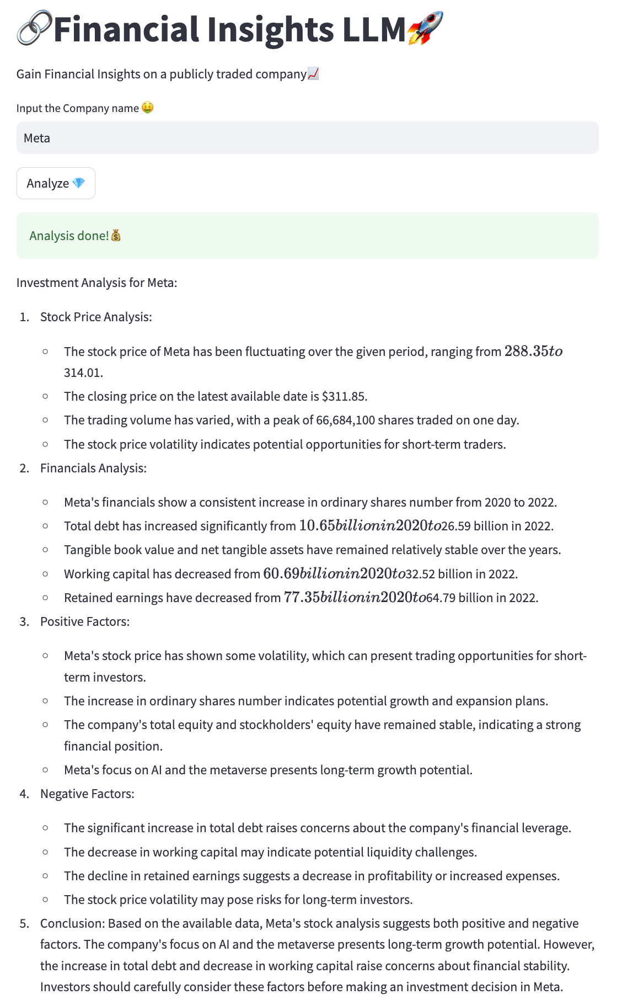

# FinancialInsightsLLM
Using GPT 3.5 to find suitable insights from scraped stock info.
## Setup

pip install streamlit
pip install openai

You need to set your OPENAI_API_KEY as environemntal variable, follow my blog to (set-up)[https://medium.com/@itsanirudhjoshi/how-to-safely-use-the-openai-api-key-without-exposing-it-in-your-code-%EF%B8%8F-setting-it-as-an-a10cccbb9a7f]

## Sample

